# Anatomically-Constrained Latent Diffusion for Rare Periodontal Case Augmentation

Computer Vision — Sapienza Università di Roma, A.A. 2025–2026 (Prof. Irene Amerini).
Project 3 by **Sonia Sapia**.

A from-scratch 2D Latent Diffusion Model that synthesises periapical dental X-ray patches of a single
tooth, conditioned on a 5-class anatomical mask, so that the generated alveolar bone level is
geometrically consistent with the tooth root. It answers the question left open by the reference paper: does the anatomical mask constraint work in the latent space, or does it lose too much spatial precision?

* * *

## Main findings

**1. Latent space costs spatial precision, and an explicit anatomical constraint does not buy it
back.** Konz et al. (MICCAI 2024) warn that moving anatomically-guided diffusion into a latent space
risks losing "precise spatial guidance", but they explicitly state: *"we did not
compare to ControlNet-like latent diffusion models trained completely from scratch."* This project
builds that, along with a pixel-space baseline through identical code, and an anatomical
loss applied to both. The constraint helps both spaces by the same amount, so the gap survives:

| Dice, exposed root | latent | pixel | gap |
|---|---|---|---|
| plain mask conditioning | 0.5915 | 0.7572 | 0.1657 |
| + anatomical loss | 0.7358 | 0.9001 | 0.1643 |

Four independent measurements (two models × two evaluators) agree to within 0.0015. **Konz's warning
is confirmed.**

**2. The anatomical loss works, everywhere, for free.** +0.14 Dice in both spaces, FID unchanged
(249.9 → 253.9 latent; 139.8 → 138.0 pixel), and it regularizes: both
unconstrained runs reach their validation minimum at step 5000 and then overfit, both constrained runs
keep improving to step 7000–10000.

**3. Anatomical *command* fails in every configuration, and the binding constraint is data, not
architecture.** On out-of-distribution masks (crest moved to command a severity the model has barely
seen), the best model realizes **38% of the commanded change** and the worst 14%. The dataset contains
**3 Severe teeth out of 575**, and neither architecture nor loss can solve that.

Moreover, the results show that **the constrained pixel model exceeds the real-image ceiling** on
mask conformance (0.9001 vs 0.8127) with FID unchanged, meaning generated images are *easier to segment* than
real radiographs. Dice-against-mask stops measuring realism well before a generator stops improving.

* * *

## Dataset

[**perio-KPT**](https://zenodo.org/records/14711842) — Periodontal Bone Loss Keypoint and Detection
Dataset (Banks et al., [arXiv:2503.13477](https://arxiv.org/abs/2503.13477)).
Only available on request.

Once downloaded, the `perio_KPT/` directory is structured as follows:

| Folder | Content | Count |
|---|---|---|
| `0_Baseline/` | periapical radiographs (PNG, 97 distinct sizes, 320×245 → 1944×1481) + YOLO-pose labels + rotating boxes | 192 images, 771 instances |
| `1_Experiment/` | the same 192 images as 5-fold CV splits | — |
| `2_Auxiliary_Segmentation/` | pseudo-periapical crops of panoramic radiographs with tooth polygons | 3229 train / 359 val, 31807 polygons |
| `3_External_Set/` | external periapicals, re-annotated | 15 images |

[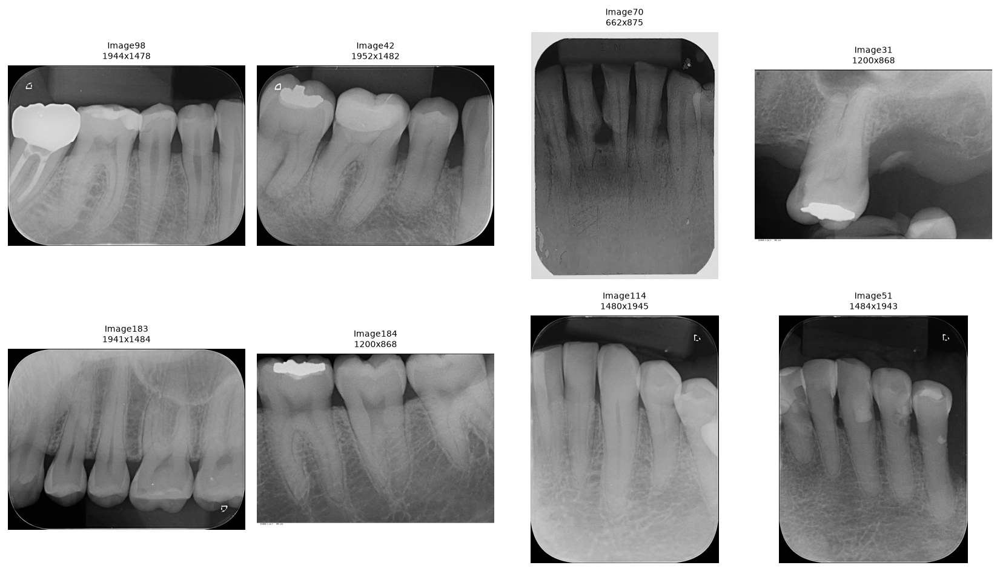](figs/d1_raw.png)
*Raw radiograph diversity. 97 distinct resolutions across 192 images.*

### Reframing the problem

The 5 YOLO classes are not periodontitis stages, but tooth morphologies:

```
0 Single Root 382 | 1 Double Root 160 | 2 Triple Root 34 | 3 ARR 52 | 4 PLS 143
```

Severity has thus to be computed from the 11 keypoints, per Banks et al.:

```
PBL_side = |proj(CEJ -> BL)| / |proj(CEJ -> apex)|   along the tooth long axis
Healthy < 0.15 <= Mild < 0.33 <= Moderate < 0.66 <= Severe
```

[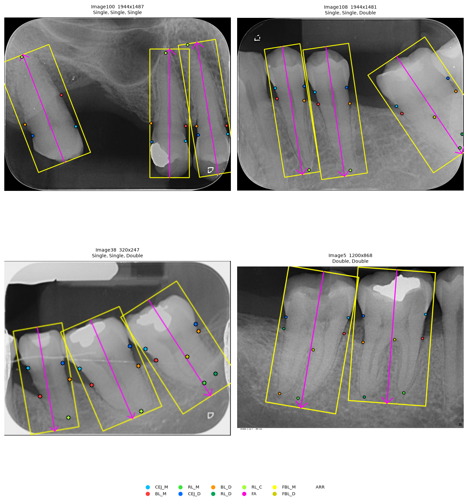](figs/d2_annotations.png)
*The raw annotations: rotating tooth boxes, the keypoint set (legend at bottom), and the FA long-axis line that PBL_side is projected onto.*

Over all 192 images: 1146 valid tooth-sides, 575 teeth (classes 0/1/2 only), tooth-level severity =
worst side:

```
Healthy 190 (33.0%)   Mild 273 (47.5%)   Moderate 109 (19.0%)   Severe 3 (0.5%)
```

There are only 3 Severe teeth.

[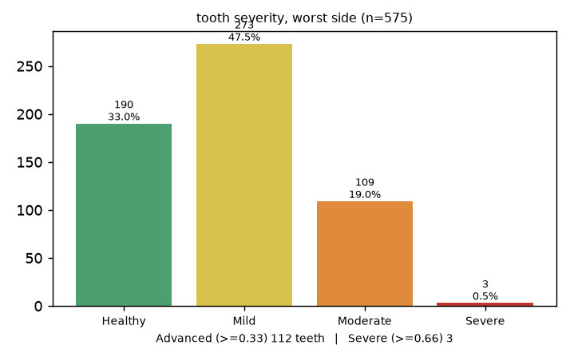](figs/d6_stats_croppe.png)
*The class-imbalance problem.*

The downstream rare class is therefore **Advanced = Moderate + Severe (PBL ≥ 0.33)**, n = 112 teeth
(19.5%). The 4-way severity axis is kept for generation targets and reporting.

[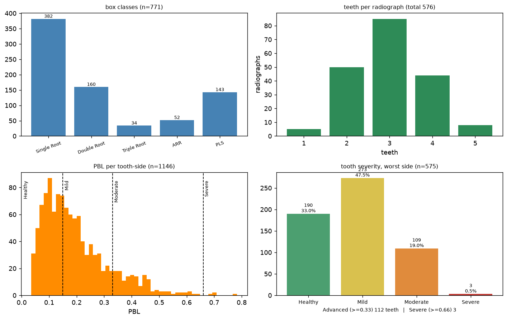](figs/d6_stats.png)
*Full dataset statistics: tooth morphology classes, teeth per radiograph, the raw PBL distribution with the severity thresholds overlaid, and the worst-side severity histogram.*

The `2_Auxiliary_Segmentation/` folder was also probed as a way to enlarge the generator's training
set (it did not work out. See [Limitations](#limitations)):

[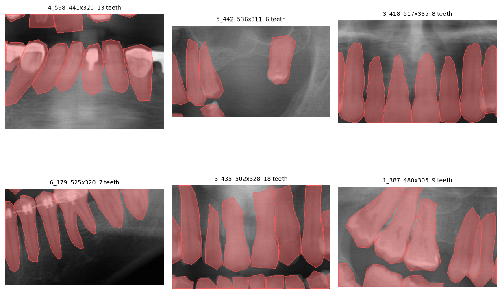](figs/d3_auxseg.png)
*Auxiliary segmentation set: tooth polygons on pseudo-periapical crops of panoramic radiographs, a different imaging domain from the periapical baseline set.*

* * *

## Environment and how to run

Verified on a RTX 5060 Laptop GPU, 8 GB VRAM, 14 GB RAM.

```
Python 3.14.7
torch 2.13.0+cu130   torchvision 0.28.0+cu130   diffusers 0.39.0
torchmetrics 1.9.0   opencv-python-headless 5.0   numpy 2.5.1   matplotlib 3.11.1   tqdm 4.70.0
```

```bash
python -m venv venv && source venv/bin/activate
pip install torch torchvision opencv-python-headless "torchmetrics[image]" diffusers matplotlib tqdm
PYTORCH_CUDA_ALLOC_CONF=expandable_segments:True jupyter lab
```

Then **Restart & Run All**. The notebook follows the mandated structure:

```
[Imports]  [Globals]  [Utils]  [Data]  [Network]  [Train]  [Test]
```

Every training cell caches its checkpoint under `cache/ckpt/` and skips retraining if it is present;
the checkpoints need to be deleted to force a rerun. From a cold cache the full pipeline is roughly:

| Stage | Time |
|---|---|
| Data, patches, auxiliary patches | ~1 min |
| `S_build`, `S_eval`, `S_eval2` | ~7 min each |
| VAE (with adversarial term) | ~2–3 h |
| Conditional LDM | 52 min |
| Conditional LDM + anatomical loss | 1 h 06 |
| Pixel DDPM | 4 h 13 |
| Pixel DDPM + anatomical loss | 4 h 20 |
| Synthetic banks (1600 patches) | ~2 h |
| Downstream classifier (11 arms × 5 seeds) | ~2 h |

With the cache present, a full pass is about 40 minutes, most of it sampling.

* * *

## Method

Standard DDPM noising, for orientation:


### Patch definition

Tooth boxes have an aspect of about 1:3, therefore a square resize would lose a lot of information, so instead the procedure to extract the tooth patches is:

1. Rotate about the box centre so the tooth long axis is **vertical**; 
2. **Canonicalize crown-up.** Periapical radiographs contain maxillary (crown down) and mandibular
   (crown up) teeth.
3. Crop the box widened to aspect 1:2 with 15% margin, so as to pull in the neighbouring
   alveolar bone, which the model needs in order to render a plausible crest.
4. Resize to **256 × 128**, grayscale, normalise to [−1, 1].

### The anatomical mask (conditioning signal)

A 5-class label map per patch in the rotated, crown-up frame:

```
0  background / soft tissue
1  crown          tooth AND coronal to the CEJ line
2  exposed root   tooth AND between the CEJ line and the crest line   <- the bone-loss signature
3  embedded root  tooth AND apical to the crest line
4  alveolar bone  not-tooth AND apical to the crest line
```

[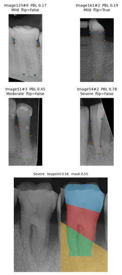](figs/masks.png)
*Example: keypoints → PBL → 5-class mask, for a Severe tooth.*

The tooth silhouette comes from **`S_build`**, a binary UNet trained on ~8000 auxiliary tooth patches
extracted in *identical geometry* (val Dice 0.9221), mirroring Banks et al.'s own use of an auxiliary
instance-segmentation model to align keypoints to tooth boundaries.

[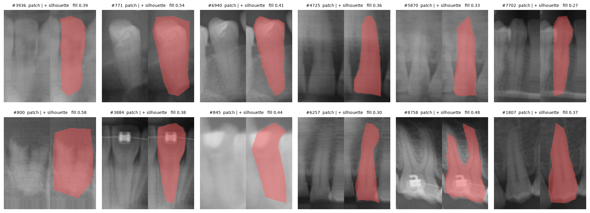](figs/d8_aux_patches.png)
*`S_build`'s training data: auxiliary tooth patches (top) and the image reconstructed from nothing but their binary mask (bottom)*

[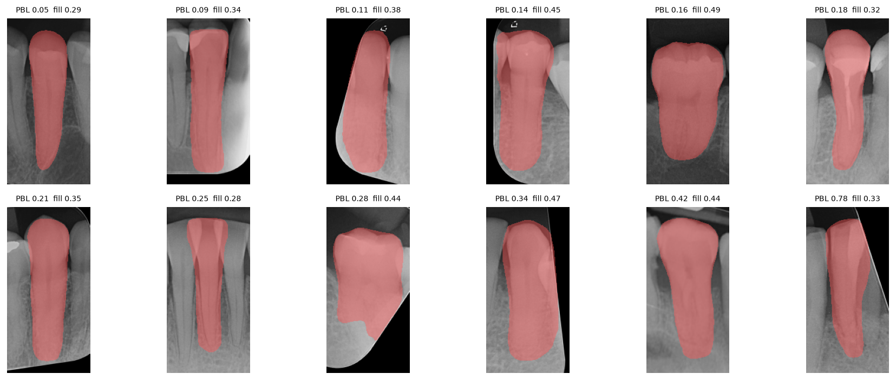](figs/b1_s_build.png)
*`S_build` silhouettes across the PBL range (val Dice 0.9221).*

This encodes severity **geometrically**: `PBL = (y_crest − y_CEJ) / (y_apex − y_CEJ)`. Commanding a
severe case therefore means translating the crest line apically (`retarget_mask`), which
requires no severe training example.

[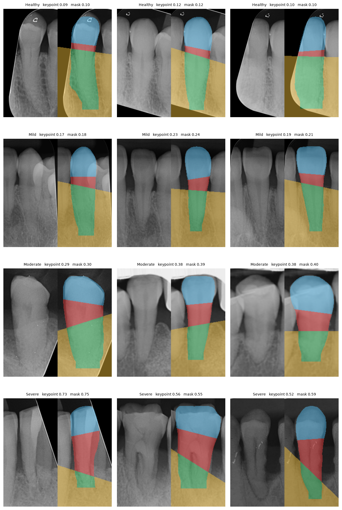](figs/b2_masks.png)
*The 5-class mask across all four severity bands.*

[](figs/b2_masks_cropped.png)
*Close-up on the two boundary lines (CEJ, crest) that actually separate the three tooth-region classes.*

### Models

| Name | Spec | Params | Purpose |
|---|---|---|---|
| `S_build` | binary UNet @ 256×128 | 7.76M | tooth silhouette for mask construction |
| `S_eval` | 5-class UNet @ 256×128 | 7.76M | faithfulness evaluator |
| `S_eval2` | same, different seed / batch order / selection criterion | 7.76M | second evaluator, never inside any loss |
| `VAE` | `AutoencoderKL`, random init, f=4, z=4ch | 3.48M | 256×128 → 64×32×4 |
| `LDM` | `UNet2DModel`, random init, in 9 / out 4 @ 64×32 | 29.1M | the deliverable |
| `DDPM-px` | same family, in 6 / out 1 @ 256×128 | 29.25M | Konz-equivalent pixel baseline |
| `Clf` | ResNet-18, ImageNet weights, 1-channel input | 11.17M | downstream classifier |

`S_build` and `S_eval` are deliberately two different networks with two different training sets, because using one network both to build the conditioning masks and to score fidelity would make every faithfulness number circular.

[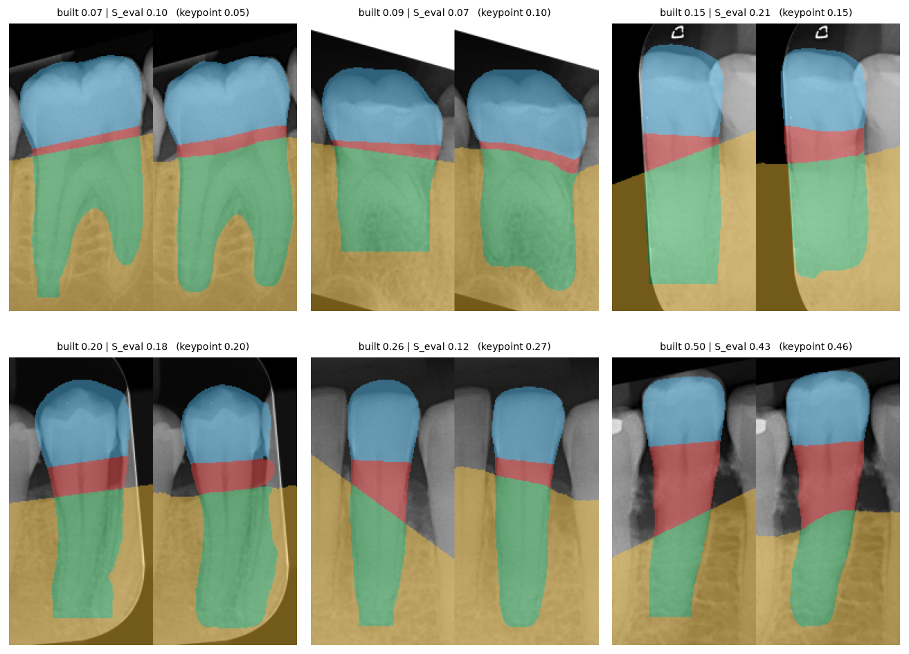](figs/b3_s_eval.png)
*Three independent PBL estimates:`S_build`'s own silhouette, `S_eval` reading that silhouette back, and the keypoint ground truth, agreeing to within a few points.*


### Conditioning

Following Konz §1.2, the mask is concatenated channel-wise to the network input at every denoising
step. The latent version nearest-downsamples the integer label map to 64×32 and **one-hots to 5
channels**. One-hot was chosen rather than a single integer channel because integer labels acquire false
ordinality under downsampling.

**Mask-ablated training** (Konz Algorithm 1): per sample, per class, Bernoulli erasure, but with
`p_class = 0.25` instead of Konz's 0.5, because 393 training patches is not thousands, and the change
took PBL correlation from +0.176 to +0.382. Extended with `p_null = 0.1` full-mask drop, which gives a
proper null condition for classifier-free guidance (Konz has no CFG) and provides the *unguided
synthetic* control that the downstream experiment needs, from the same model, for free.

### The anatomical loss

Decode the model's `x0`-prediction, push it through the frozen `S_eval`, and penalise disagreement with
the mask that was commanded:

```python
def anat_term(seg, pred, zt, t, m_true, m_used, latent=True, t_max=400, n_max=4):
    keep = (t < t_max) & (m_used == m_true).flatten(1).all(1)
    i  = keep.nonzero()[:n_max, 0]
    a  = sched.alphas_cumprod[t[i]][:, None, None, None]
    z0 = (zt[i] - (1 - a).sqrt() * pred[i]) / a.sqrt()
    img = vae.decode(z0 / LATENT_SCALE).sample if latent else z0
    return seg_loss5(seg(img).float(), m_true[i])
```

Only low `t` (above it the `x0`-prediction is still noise); only rows
whose mask survived ablation (an erased class was never commanded, so punishing its absence would be
wrong); and a cap on the decoder batch, which is the only new allocation the term adds. In pixel space
there is nothing to decode since the `x0`-prediction is already the image the segmenter reads.

The weight is not a hand-tuned hyperparameter. It uses gradient-norm matching (Esser et al. 2021),
the same mechanism already used for the VAE's adversarial term, times a single fixed 0.25.

`S_eval` is the project's evaluator. Optimising
against it and then measuring with it would make every number circular.  The adopted solution is `S_eval2`, a third segmenter the loss never
sees. It is independent *of the loss*, not *of the data* (395 patches is all there is), so it rules out
idiosyncratic gaming of `S_eval` and not shared bias, which is why FID/KID, the only instrument here
that involves no segmentation network, is reported alongside.

* * *

## Evaluation protocol

This is the part the project cares most about, and it is stricter than the reference paper's.

**Every metric is reported next to what real images score through the same instrument.** `S_eval`'s own
error on real validation patches is PBL MAE **0.0436**, and that is the measurement floor, and no
generated-image PBL difference below it is interpretable. Real TEST images through `S_eval` score Dice
0.8127 on exposed root; that is the ceiling, and no model can be praised for approaching a number
without knowing what perfect looks like on the same ruler. *Konz reports 0.9027 with no such
denominator.*

**Chance anchors.** `w = 0` (the null condition) still scores Dice 0.293 on exposed root and PBL
correlation +0.023. Without that anchor, 0.29 would look like partial success.

**Two evaluators.** Every number in the anatomical-loss section is reported under both `S_eval` and
`S_eval2`. They agree closely on real images (PBL MAE 0.0382 vs 0.0428) and diverge substantially on
generated ones (0.1377 vs 0.2012). **Absolute levels on generated images therefore
carry that uncertainty; differences between models do not, because both judges agree on the sign and
magnitude of every comparison made here.**

**Paired comparisons wherever possible.** Downstream arms share seeds, so the per-seed difference
cancels the seed effect the two arms have in common. Perturbation experiments compare each arm against
its own unperturbed reference. Paired differences below the absolute floor are still meaningful,
because systematic error cancels.

**Five sanity checks**:

| Check | Criterion | Outcome |
|---|---|---|
| 1 — PBL reproduction | 1146 sides; 190/273/109/3; 69 images vs the clinicians' 70 | **PASS** |
| 2a — the crest is not damaged more than the rest | median `crest_ratio` < 1.25 | **PASS** (0.949) |
| 2b — the VAE does not blur everything flat | HF retention at σ=1.5 > 0.75 | **FAIL** (0.706) |
| 3 — mask ↔ keypoint agreement | PBL MAE < 0.02 over all patches | **PASS** (0.0138, stage agreement 0.928) |
| 4 — overfit one batch | samples traceable to the 16 training patches | **PASS** |
| 5 — the mask reaches the denoiser aligned | commanded-vs-realised PBL correlation > 0.5 | **PASS** (+0.922) |

[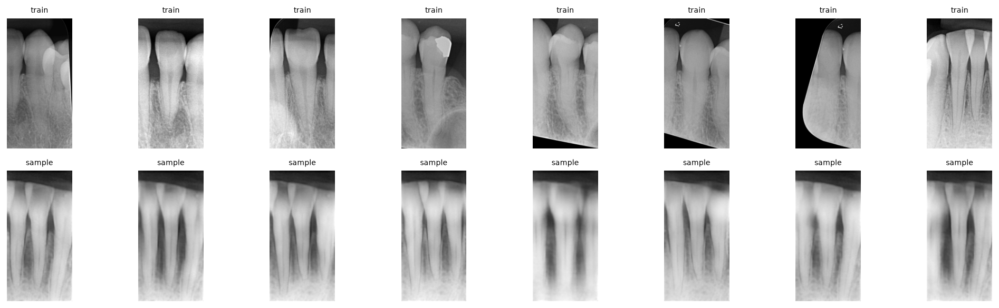](figs/a3_gate4.png)
*Sanity check 4: samples from a model trained to overfit 16 patches. Each one is visually traceable back to its source patch — proof the conditioning pathway actually carries information, before a single full-scale run is spent.*

[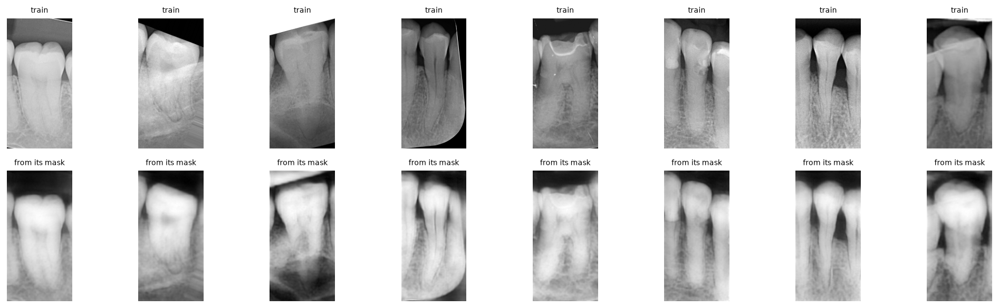](figs/b4_gate5.png)
*Sanity check 3 in miniature: keypoint PBL vs. mask PBL, side by side, before a single training run is launched on top of these masks.*

Sanity check 2b failed at 0.706 against a 0.75 target set before the run. It was not chased , bacause by then the
bottleneck had measurably moved to the diffusion, and the VAE round-trip was shown to cost only 0.008
Dice.

* * *

## Results

[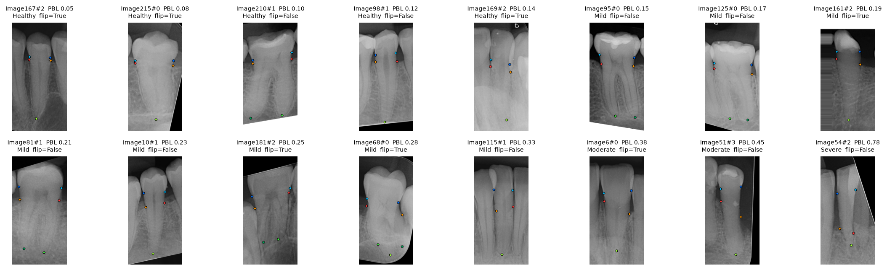](figs/d7_patches.png)
*Real training patches (top) next to generated samples in the same geometry (bottom) — the qualitative baseline every number below is trying to characterise precisely.*

### VAE (the compression the whole latent pipeline rests on)

PSNR 36.16 | SSIM 0.917 | LPIPS 0.148 | rFID 56.1 | HF retention 0.706 (Gate 2b target 0.75).
Crucially, the round-trip costs almost nothing anatomically: Dice on exposed root 0.8127 → **0.8043**,
PBL bias +0.0004 → **+0.0047**. The autoencoder is not the bottleneck.

[](figs/a7_vae_train.png)
*VAE training: reconstruction loss, the Sanity check 2b diagnostics (HF retention, LPIPS) before and after the adversarial term switches on at step 3000, and the adversarial game itself.*

[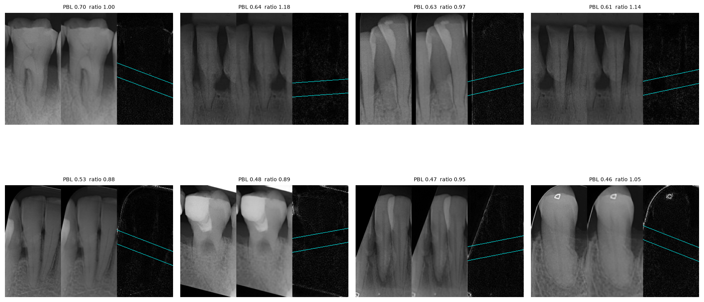](figs/a1_vae_probe.png)
*VAE round-trip probe across the PBL range — real | reconstruction | difference, crest line marked. The anatomy that matters survives compression essentially intact.*

### H1 — latent vs pixel, same masks, same code path

```
                          LDM (latent)   DDPM (pixel)   real = ceiling
Dice, exposed root              0.5915         0.7572           0.8127
Dice, mean over classes         0.8069         0.8849           0.9079
PBL MAE                         0.1377         0.0555           0.0382
PBL correlation                 +0.382         +0.698           +0.876
PBL bias                       +0.1210        +0.0027          +0.0004
stage agreement                  0.373          0.722            0.810
FID / KID                 249.9 / 0.199  139.8 / 0.043
training time                   52 min          4h13
```

[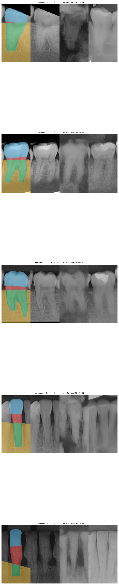](figs/c1_h1.png)
*H1, qualitatively: the same mask, the real image it came from, and one sample from each model. The pixel model's extra fidelity is visible, not just a Dice number.*

Decomposed: real 0.8127 → **+ VAE round-trip 0.8043** → + latent diffusion 0.5915. The loss is almost
entirely the diffusion in the latent space, not the compression.

For context, Konz's own latent baseline (fine-tuned Stable Diffusion + ControlNet, ~12000 training
slices) scores 0.36 and 0.11 Dice on his two datasets. Ours, trained from scratch on 393 patches,
scores 0.807 mean. Dice is not comparable across domains and his ceiling is unknown, but the *ranking*
of latent-from-scratch against latent-finetuned is informative.

### H3 — guidance-strength ablation

```
   w   Dice cl.2   PBL MAE     corr    stage   LPIPS div     FID
 0.0      0.2927    0.2502   +0.023    0.238       0.488   251.2
 1.0      0.5915    0.1377   +0.382    0.373       0.454   249.9
 2.0      0.4125    0.2150   -0.026    0.349       0.465   289.5
 3.0      0.2169    0.3006   -0.053    0.175       0.479   319.8
 5.0      0.1479    0.5032   -0.051    0.095       0.476   342.3
 8.0      0.1520    0.5218   -0.113    0.112       0.461   361.9
```

[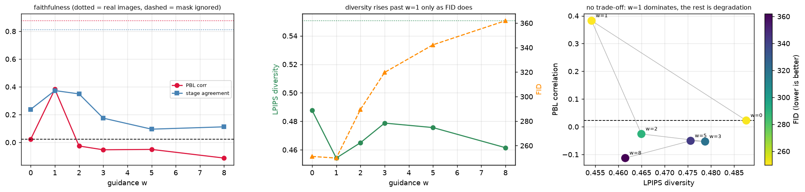](figs/b6_guidance.png)
*The H3 ablation in full: faithfulness peaks at w=1 and only degrades afterward; the diversity that does rise past w=1 is coincident with rising FID, not a real fidelity/diversity trade-off; w=1 dominates every other setting on both axes at once.*

Classifier-free guidance **does not help here and actively hurts**: everything degrades monotonically
above `w = 1`, and FID with it. This is a negative result that was hypothesised twice as a fix and
refuted twice. Diversity barely moves (0.454–0.488 against 0.551 for real TEST patches), so there is no
fidelity/diversity trade-off curve to draw: the trade-off the brief expects does not exist in this
regime, and saying so is more useful than drawing a curve that isn't there.

[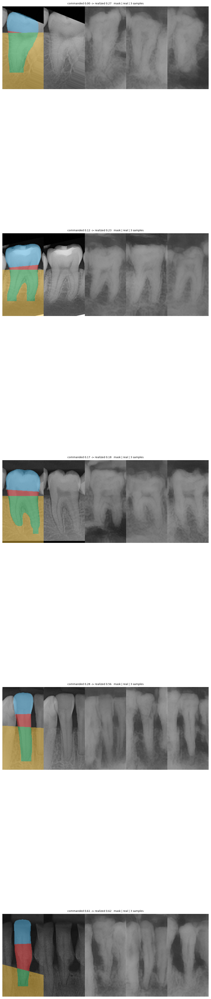](figs/b5_faithfulness.png)
*Within-mask diversity: three samples per commanded mask. Structure is consistent across samples; the diversity that exists is in texture, not in anatomy,consistent with the LPIPS numbers above.*

### The counterfactual — does the command carry off-distribution?

16 teeth × 5 commanded PBL values spanning 0.10–0.85, on masks whose severity the model has essentially
never seen. The retargeted masks are checked first: PBL is read back out of them and compared with what was
commanded (printed by the retargeting cell), so any failure below belongs to the generator.

```
model                  judge     within-tooth r    slope   monotone
latent, plain          S_eval2           +0.224    0.137      3/16
latent + anatomic      S_eval2           +0.503    0.380      3/16
pixel, plain           S_eval2           +0.447    0.211      0/16
pixel + anatomic       S_eval2           +0.585    0.259      8/16
```

[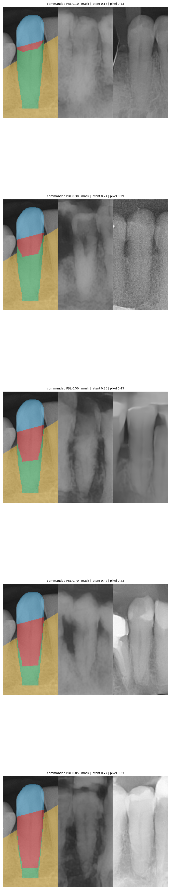](figs/c2_retarget.png)
*The counterfactual, qualitatively: same tooth, five commanded severities from 0.10 to 0.85. The mask changes drastically; the generated tooth mostly does not.*

[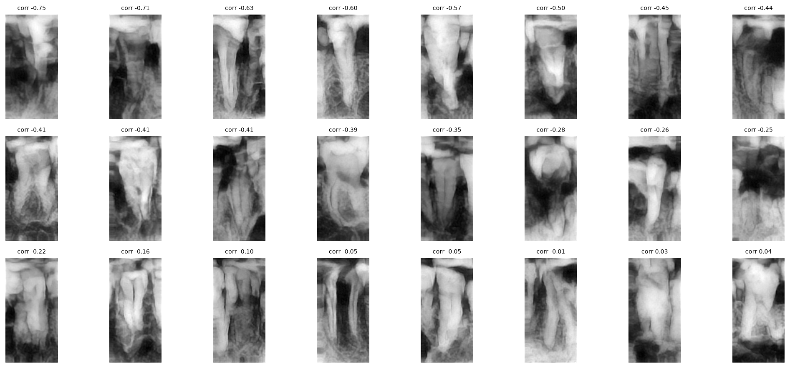](figs/a5_failures.png)
*Per-tooth counterfactual correlation, sorted. Most teeth show a flat or *negative* response to the commanded severity.*

**No model obeys.** The best slope in the entire table is 0.380 — 62% of the command ignored. The
constraint changes the *shape* of the failure rather than removing it: the constrained pixel model is
by far the most consistent (8/16 monotone) but its response is compressed; the constrained latent model
has the largest amplitude but stays incoherent.

Bank composition tells the same story from another direction. Commanded 100% Advanced / 60% Severe, the
banks actually contain:

```
             realised PBL    >= 0.33   >= 0.66
pixel, unguided   0.216        12%        0%       <- the prior, correctly reproduced
pixel, guided     0.321        42%        2%       <- a genuine 3.5x, attributable to the command
latent, unguided  0.412        56%       14%       <- not the guidance: the +0.12 latent bias
latent, guided    0.428        69%       10%
real TRAIN        0.196        19%        1%
```

The pixel model conditions genuinely. The latent bank has *more* nominal Advanced content for the wrong
reason — it draws severe cases by default, not on command.

### H2 — downstream impact

Binary tooth-patch classifier, Normal vs Advanced (PBL ≥ 0.33), 11 arms × 5 seeds, class-balanced
sampling, identical schedule, checkpoint selected on a **real-only** validation set in every arm.
TEST holds 126 patches from 39 unseen radiographs, 24 of them Advanced.

Because the synthetic banks are labelled by *intent* while their images only partly agree, the same
four banks were passed through three labelling regimes, so that "the guidance does not help" and "the
labels are wrong" could be told apart:

| | label | what it tests |
|---|---|---|
| `B` / `D` | intent — everything Advanced | what a user of the engine gets |
| `E` / `F` | measured — `S_eval` reads PBL ≥ 0.33 | removes the label noise |
| `G` | filtered — only the genuinely Advanced patches | adds real rare cases |

```
paired per-seed differences        d mAP              wins
B_px  - A   (synthetic helps)    +0.037 +- 0.041      4/5
B_px  - D_px (guidance, intent)  +0.013 +- 0.032      4/5
E_px  - F_px (guidance, measured) +0.011 +- 0.051     3/5
G_px  - B_px (filtered)          +0.004 +- 0.025      3/5
```

[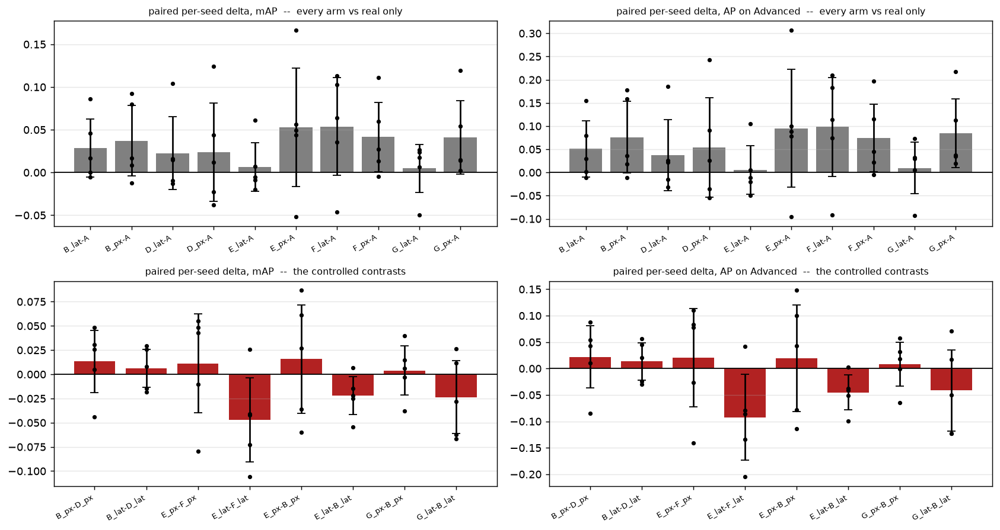](figs/c3_downstream.png)
*H2 in full: every synthetic arm beats real-only by a small, mostly-positive margin (top row); the controlled contrasts that isolate guidance or labelling collapse toward zero with error bars that straddle it (bottom row).*

Synthetic data helps a little and consistently in direction (+0.023 to +0.037 mAP across all four
banks). **The anatomical guidance contributes nothing detectable**, with intent labels or measured
ones. And the gain does not track rare-case content at all: `G_px` adds 170 genuinely Advanced patches
— 2.3× the 75 real ones in TRAIN, and does no better than a bank with 48.

The reason is structural, not statistical. TEST holds **24** Advanced teeth; one tooth moving sides
shifts AP by ~4 points, twice the effect being looked for. All seeds see the same TEST, so more seeds
do not help, but a larger test set would. Every number in this section is at ~1σ and should be read as
*not detectable*, not as *absent*.

One effect **is** consistent across all four banks: labelling synthetic patches by what the image
*shows* rather than what was *commanded* improves macro-F1 in 4 cases out of 4. That is probably the
most transferable practical finding here: **a conditional generative augmentation engine should be
labelled by measurement, not by intent, whenever its fidelity to the command is below 1.**

### The anatomical loss, in both spaces

```
S_eval (inside the loss)   Dice exp. root   Dice mean   PBL MAE     bias     corr
latent, plain                      0.5915      0.8069    0.1377  +0.1210   +0.382
latent + anatomic                  0.7358      0.8730    0.1131  +0.1001   +0.346
pixel, plain                       0.7572      0.8849    0.0555  +0.0027   +0.698
pixel + anatomic                   0.9001      0.9480    0.0274  -0.0081   +0.865
real = ceiling                     0.8127      0.9079    0.0382  +0.0004   +0.875

S_eval2 (outside the loss)
latent, plain                      0.5434      0.7791    0.2012  +0.1834   +0.252
latent + anatomic                  0.6754      0.8380    0.1943  +0.1801   +0.148
pixel, plain                       0.7429      0.8803    0.0630  +0.0095   +0.537
pixel + anatomic                   0.8763      0.9376    0.0291  -0.0052   +0.877
real = ceiling                     0.8066      0.9067    0.0428  +0.0059   +0.750
```

[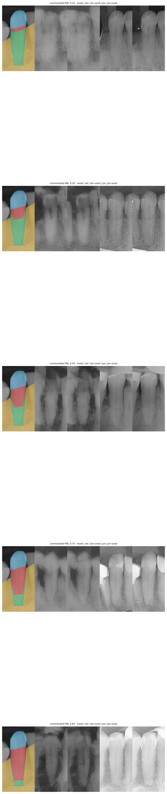](figs/c4_anatomical.png)
*The anatomical loss, qualitatively, in both spaces at once. Both constrained columns look more decisively "boned" at the crest than their plain counterparts, most visibly on the pixel side.*


### Why does the gap survive? — a probe of the latent's geometry

Each TEST patch is interpolated towards the **same** partner patch, in both spaces, and two quantities
are measured: how much the *image* changed, and how much the *anatomy* changed.

```
  eps    space     visible dL1   |dPBL|   dPBL/dL1
 0.05    pixel          0.0082   0.0035       0.43
 0.05    latent         0.0067   0.0040       0.60     1.40x
 0.10    pixel          0.0166   0.0071       0.43
 0.10    latent         0.0137   0.0083       0.60     1.40x
 0.50    pixel          0.0829   0.0652       0.79
 0.50    latent         0.0815   0.0764       0.94     1.19x
```

[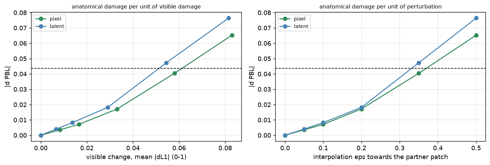](figs/e1_latent_geometry.png)
*The latent curve sits above the pixel curve on both axes: at equal perturbation, the latent space produces less visible change for more anatomical damage, and crosses the measurement floor (dashed) sooner.*

At equal perturbation the latent produces less visible change and more anatomical damage, exactly
the disproportion the hypothesis predicted. But the factor is **1.4**, and the observed PBL MAE gap is
**2.5**. So the diagnosis has two terms, and the measured one is the smaller: the latent is genuinely
more anatomically brittle, and the dominant term is simply that latent diffusion lands further from the
real manifold to begin with (FID 249.9 vs 139.8).

[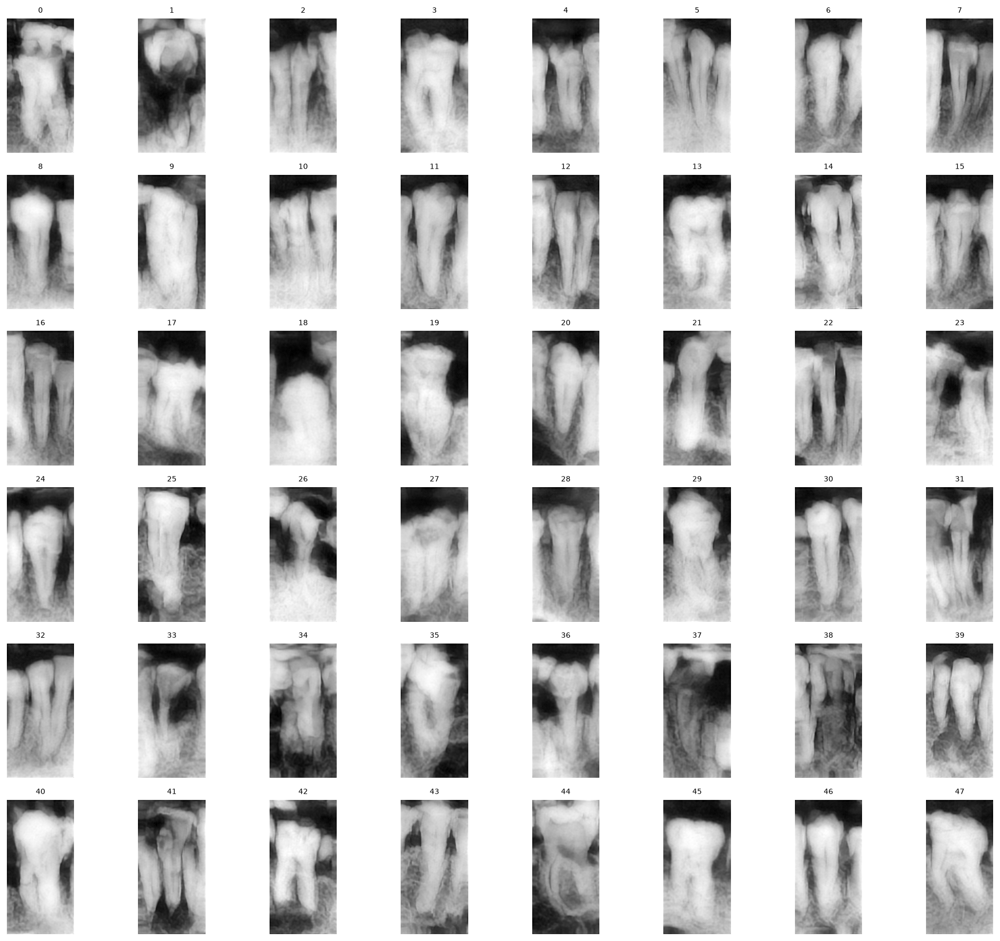](figs/a5_catalogue.png)
*A catalogue of 48 unguided generations.*

* * *

## Limitations

- **3 Severe teeth in 575.** No architecture, loss, or sampling scheme in this project overcomes it,
  and the counterfactual result is the direct measurement of that.
- **24 Advanced teeth in TEST.** The downstream experiment is below its own resolution. More seeds
  cannot fix it; a larger test set could.
- **Both evaluators share their training data.** 395 patches is all there is, so `S_eval2` rules out
  idiosyncratic gaming and not shared bias. FID/KID is the only segmenter-free instrument here.
- **Absolute levels on generated images are uncertain by a factor of ~13 between two equivalent
  evaluators.** Model-to-model differences are robust; single numbers are not.
- **Sanity check 2b was never passed** (HF retention 0.706 vs a 0.75 target). Deliberately not chased.
- **A PatchGAN discriminator is still in the VAE training code.** It was measured to be a no-op after
  the training distribution was rebalanced, but `vae.pt` was produced with it, so it stays until the
  next VAE retrain rather than silently changing the artefact everything else rests on.
- **The auxiliary set could not be used to enlarge the generator's data.** Probed directly: `S_eval`
  can read only ~27% of auxiliary patches (HF 1.456 vs 5.450, a different imaging domain), and the two
  evaluators contradict each other on the severe tail. Not that the data is poor; we cannot label it.

  [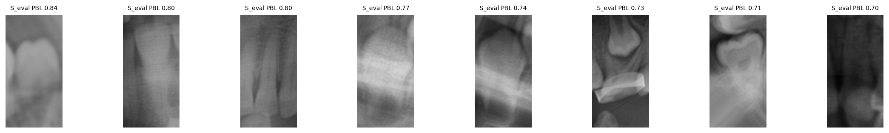](figs/d9_aux_pbl.png)
  *`S_eval` applied to auxiliary patches*

- **`Severe` is 3 teeth, so the 4-way stage axis is reported but never used as a training target.**

* * *

## References

1. Konz, N., Chen, Y., Dong, H., Mazurowski, M. A. *Anatomically-Controllable Medical Image Generation
   with Segmentation-Guided Diffusion Models.* MICCAI 2024. [arXiv:2402.05210](https://arxiv.org/abs/2402.05210)
2. Banks, et al. *Periodontal Bone Loss Keypoint and Detection Dataset.* [arXiv:2503.13477](https://arxiv.org/abs/2503.13477)
3. Ho, J., Jain, A., Abbeel, P. *Denoising Diffusion Probabilistic Models.* NeurIPS 2020.
4. Rombach, R., et al. *High-Resolution Image Synthesis with Latent Diffusion Models.* CVPR 2022.
5. Esser, P., Rombach, R., Ommer, B. *Taming Transformers for High-Resolution Image Synthesis.* CVPR 2021.
   (adaptive adversarial weight by gradient-norm matching)
6. Isola, P., et al. *Image-to-Image Translation with Conditional Adversarial Networks.* CVPR 2017. (PatchGAN)
7. Lim, J. H., Ye, J. C. *Geometric GAN.* 2017. (hinge loss)
8. Heusel, M., et al. *GANs Trained by a Two Time-Scale Update Rule Converge to a Local Nash Equilibrium.*
   NeurIPS 2017. (FID, TTUR)
9. Ho, J., Salimans, T. *Classifier-Free Diffusion Guidance.* 2022.
10. Kazerouni, A., et al. *Diffusion models in medical imaging: a comprehensive survey.* Medical Image
    Analysis, 2023.
11. Pinaya, W. H. L., et al. *Brain Imaging Generation with Latent Diffusion Models.* MICCAI 2022.
12. Park, T., et al. *Semantic Image Synthesis with Spatially-Adaptive Normalization.* CVPR 2019. (SPADE)

Adaptive adversarial weighting follows Esser et al. (5); the PatchGAN discriminator and hinge loss
follow Isola et al. (6) and Lim & Ye (7); TTUR follows Heusel et al. (8).

